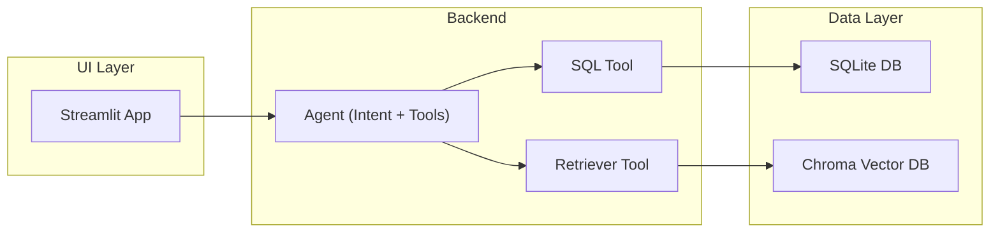
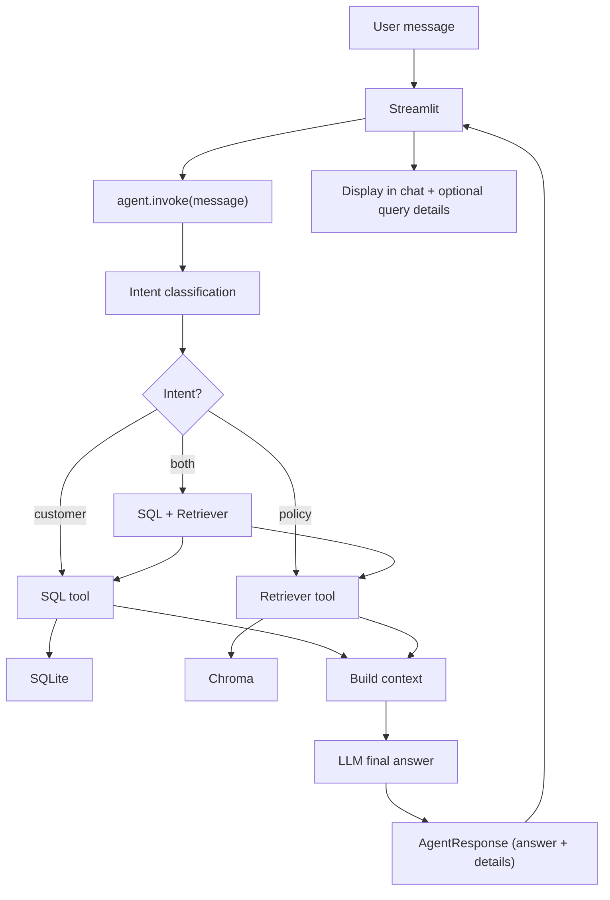
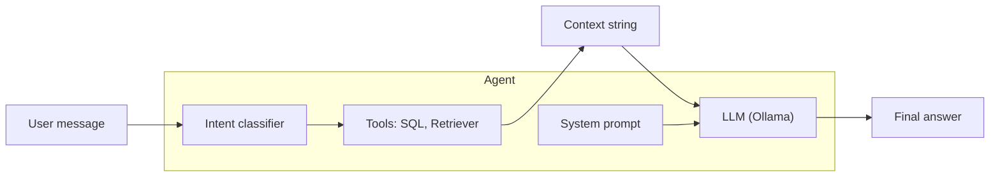
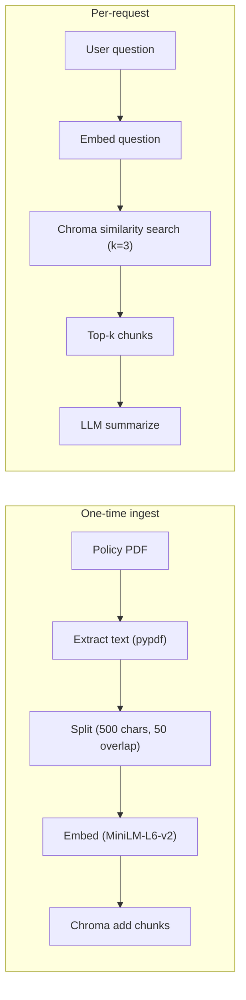
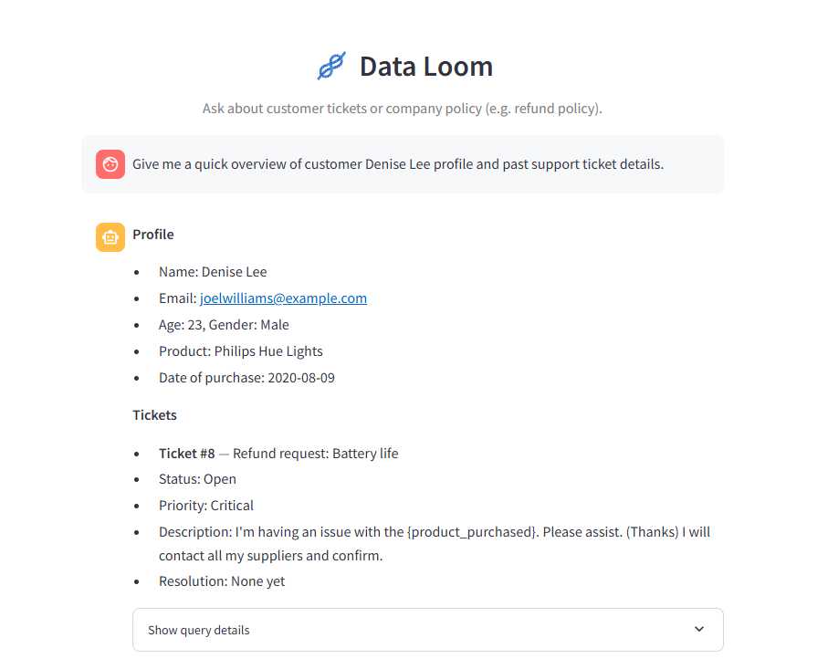

# <h1 align="center">DataLoom — Generative AI Multi-Agent Support Assistant</h1>

**A Generative AI Multi-Agent System that enables natural language interaction with structured customer data (SQL) and unstructured policy documents (RAG), delivering accurate, context-aware responses for customer support.**

 

---

## Table of Contents

- [Project Description](#project-description)
- [Features](#features)
- [Technology Stack](#technology-stack)
- [System Architecture](#system-architecture)
- [Architecture Diagrams](#architecture-diagrams)
- [Data Flow & Orchestration](#data-flow--orchestration)
- [Project Structure](#project-structure)
- [Data Strategy](#data-strategy)
- [Demo](#demo)
- [Installation](#installation)
- [Configuration](#configuration)
- [Usage](#usage)
- [Testing](#testing)
- [License](#license)
- [FAQs](#faqs)
- [Contact Information](#contact-information)

---

## Project Description

**DataLoom** is a **Generative AI–powered Multi-Agent System** built for customer support scenarios. It addresses the problem of managing and retrieving information scattered across **structured** (customer profiles, support tickets in SQL) and **unstructured** (company policy PDFs) sources.

- **Structured data:** A single SQLite table (`support_tickets`) holds customer and ticket data (from a Kaggle-style or synthetic CSV). Users ask in natural language (e.g. *“Give me a quick overview of customer Ema’s profile and past support ticket details”*); the system generates a **SELECT** query, runs it, and returns a summarized, readable answer.
- **Unstructured data:** Company policy PDFs (e.g. refund policy) are **ingested once** into a **Chroma** vector store using **sentence-transformers** embeddings. Questions like *“What is the current refund policy?”* are answered via **semantic search** (RAG) over these chunks, then summarized by the LLM.
- **Orchestration:** An **intent classifier** (heuristic + optional LLM fallback) decides whether each question is **policy-only**, **customer/ticket-only**, or **both**. The agent then calls only the relevant tool(s) (SQL and/or Retriever), aggregates results, and produces one **context-aware** answer. The UI is a **Streamlit** chat interface with an optional “Show query details” panel (intent, SQL query, SQL result, policy snippet).

The stack is **local-first**: LLM via **Ollama** (Llama 3.2 3B), embeddings via **sentence-transformers** — no external API keys required after setup.

---

## Features

- **Natural language to SQL** — Ask about customers or tickets in plain English; the agent generates a single **SELECT** for the `support_tickets` table and returns summarized results (e.g. Profile + Tickets sections).
- **Policy RAG** — Ask about refund policy, terms, or cancellation; the system retrieves relevant chunks from pre-loaded policy PDFs (Chroma + sentence-transformers) and the LLM summarizes them.
- **Intent-based routing** — Classifies each question as **policy**, **customer**, or **both**; only the needed tool(s) are invoked (no policy questions sent to SQL; no customer-only questions sent to the retriever).
- **Local LLM (Ollama)** — Uses **Llama 3.2 3B** via Ollama; runs fully offline after setup; no API keys.
- **Streamlit UI** — Single-page chat with message history and an optional **“Show query details”** expander (internal query, intent, confidence, entities, agent selection, SQL query, SQL result, policy snippet).
- **MCP server** — Optional entry point: `python -m src.mcp_server` reads one message from stdin and prints a JSON response (answer + query details) to stdout.

---

## Technology Stack

### Frontend & Interface

| Component | Technology |
|-----------|------------|
| **UI** | Streamlit — single-page chat, message history, expandable query details. |

### Backend & Agent

| Component | Technology |
|-----------|------------|
| **Language** | Python 3.10+ |
| **Agent & tools** | LangChain (prompts, chains, tools), langchain-ollama (ChatOllama) |
| **Intent & routing** | Custom intent classifier (heuristics + LLM) in `src/agent/intent.py` |
| **SQL generation** | LLM-based NL→SQL (schema-aware prompt) in `src/agent/tools.py` |
| **Config** | python-dotenv, `.env`; central `src/config.py` |

### LLM & Embeddings

| Component | Technology |
|-----------|------------|
| **LLM** | Ollama — Llama 3.2 3B (`llama3.2:3b`) — local, no API key |
| **Embeddings** | sentence-transformers — `all-MiniLM-L6-v2` (384-dim) for policy RAG |

### Data Stores

| Store | Technology | Role |
|-------|------------|------|
| **Structured** | SQLite | One table `support_tickets` (customer/ticket rows from CSV) |
| **Unstructured** | Chroma | Vector store for policy PDF chunks; persistence under `data/chroma_policies` |

### Tools & Utilities

| Item | Purpose |
|------|---------|
| **pypdf** | PDF text extraction for policy ingestion |
| **langchain-text-splitters** | RecursiveCharacterTextSplitter (chunk_size=500, overlap=50) for policy chunks |
| **Git & GitHub** | Version control and submission |

---

## System Architecture

- **User** types in Streamlit; no file upload. Streamlit calls the agent directly (or could call MCP client that talks to `src.mcp_server`).
- **Agent** (`src/agent/agent.py`): Receives the user message → runs **intent classification** → selects tool(s) (SQL and/or Retriever) → invokes tools → builds context from tool outputs → calls LLM to produce one final answer. Returns an `AgentResponse` (answer + optional SQL query, SQL result, retrieval snippet, intent/entity details).
- **SQL tool** (`query_customer_tickets`): Input = natural language question. Uses LLM + schema to generate a single **SELECT**; executes via `sqlite_client.run_query()`; returns string `"SQL: ... \nResult: ..."`.
- **Retriever tool** (`search_policy_documents`): Input = question. Embeds query with sentence-transformers, runs Chroma similarity search (top-k=3); returns concatenated chunk text.
- **SQLite** — Single file `data/customer_support.db`, one table. **Chroma** — Persisted under `data/chroma_policies`, collection `policy_docs`.

---

## Architecture Diagrams

### High-level system architecture



### Detailed request flow (data flow)



### Agent internal flow (orchestration)



### RAG pipeline (policy documents)



---

## Data Flow & Orchestration

1. **Streamlit** sends `user_message` to `agent.invoke(message)`.
2. **Intent classification** (`classify_intent_and_entities`): Uses heuristics (keywords, person names, entities) and optional LLM for ambiguous cases. Output: `policy` | `customer` | `both`.
3. **Tool selection:**
   - `policy` → only **search_policy_documents**
   - `customer` → only **query_customer_tickets**
   - `both` → both tools (e.g. “Does customer Ema qualify under refund policy?”)
4. **SQL tool:** Schema from `sqlite_client.get_schema()`; LLM generates SELECT; `sqlite_client.run_query()` (read-only); result formatted as `"SQL: ... \nResult: ..."`.
5. **Retriever tool:** `vector_store.search(query, k=3)` → embed query, Chroma `query(query_embeddings=..., n_results=3)`, return concatenated document text.
6. **Final answer:** Context = SQL result (if any) + retrieval snippet (if any). System prompt + user question + context → LLM → one string answer. Wrapped in `AgentResponse` with optional `sql_query`, `sql_result`, `retrieval_used`, `retrieval_snippet`, `nlp_details`, `agent_selection` for the UI “Show query details” panel.

---

## Project Structure

```
multi-support-agent/
├── README.md
├── requirements.txt
├── .env.example
├── .gitignore
├── app.py                          # Streamlit: chat UI, calls agent.invoke()
├── assignment/
│   └── PreQualification Instructions AI ML developers Jan26 (1) (1).pdf
├── data/
│   ├── raw/                        # CSV: Kaggle or synthetic_support_tickets.csv
│   ├── policies/                   # Policy PDF(s), e.g. refund_policy.pdf
│   ├── customer_support.db         # SQLite (created by seed_db.py)
│   ├── chroma_policies/            # Chroma persistence (created by ingest)
│   └── seed_db.py                  # Load CSV → one table support_tickets
├── public/
│   ├── DataLoomUI.png              # UI screenshot
│   └── DataLoomAgent.png           # Architecture/agent screenshot
├── scripts/
│   ├── download_policy_pdf.py      # Download refund policy PDF to data/policies/
│   └── ingest_policies.py          # Ingest PDFs → Chroma (vector_store.ingest_pdfs)
├── src/
│   ├── __init__.py
│   ├── config.py                   # Env: OLLAMA_*, DB_PATH, CHROMA_PATH
│   ├── db/
│   │   ├── __init__.py
│   │   ├── sqlite_client.py        # get_connection, get_schema, run_query (read-only)
│   │   └── vector_store.py         # Chroma client, ingest_pdfs, search (RAG)
│   ├── agent/
│   │   ├── __init__.py
│   │   ├── intent.py               # Intent classification (policy/customer/both) + entities
│   │   ├── tools.py                # query_customer_tickets, search_policy_documents
│   │   └── agent.py                # build_agent, invoke → AgentResponse
│   └── mcp_server.py               # stdin/stdout chat: one message → JSON response
└── tests/                          # Optional: pytest for agent, tools, sqlite, intent
```

---

## Data Strategy

| Data | Source | Location | How created |
|------|--------|----------|-------------|
| **Structured** | Kaggle-style or synthetic CSV | `data/raw/` (CSV), `data/customer_support.db` (SQLite) | Place CSV in `data/raw/` (e.g. `synthetic_support_tickets.csv` or Kaggle “Customer Support Ticket Dataset”); run `python data/seed_db.py`. |
| **Policy PDF** | Public URL (e.g. Lightricks refund policy) | `data/policies/refund_policy.pdf` | Run `python scripts/download_policy_pdf.py`. |
| **Vector index** | Generated from PDFs | `data/chroma_policies/` | Run `python scripts/ingest_policies.py` (uses `vector_store.ingest_pdfs`). |

- **SQL table:** Single table `support_tickets`; columns normalized from CSV (e.g. `customer_name`, `ticket_subject`, `ticket_status`). Seed script ensures at least one row with customer name containing “Ema” for the assignment demo.
- **Chroma:** One collection `policy_docs`; chunks 500 chars, overlap 50; embedding model `all-MiniLM-L6-v2` (same at ingest and query).

---

## Demo

Below are snapshots of **DataLoom**: the chat UI and the agent/architecture overview.

| Chat UI | Agent / Architecture |
|---------|------------------------|
|  |  |

**Demo video:** 

▶️ [Click here to download the demo video](https://github.com/ThakkarVidhi/multi-support-agent/raw/refs/heads/main/public/multi_support_agent_demo_video.mp4)

---

## Installation

1. **Clone the repository**
   ```bash
   git clone <your-repo-url>
   cd multi-support-agent
   ```

2. **Create virtual environment and install dependencies**
   ```bash
   python -m venv .venv
   .venv\Scripts\activate   # Windows
   # source .venv/bin/activate   # Linux/macOS
   pip install --upgrade pip
   pip install -r requirements.txt
   ```

3. **Environment**
   - Copy `.env.example` to `.env`.
   - Set (defaults shown):
     - `OLLAMA_BASE_URL=http://localhost:11434`
     - `OLLAMA_MODEL=llama3.2:3b`
     - `DB_PATH=data/customer_support.db`
     - `CHROMA_PATH=data/chroma_policies`

4. **Ollama (local LLM)**
   ```bash
   ollama pull llama3.2:3b
   ```

5. **Data**
   - **Policy PDF:** Run `python scripts/download_policy_pdf.py` to download the refund policy PDF to `data/policies/`.
   - **CSV:** Place a customer support ticket CSV in `data/raw/` — e.g. name one of:
     - `synthetic_support_tickets.csv`, or
     - `customer_support_tickets.csv`
     Alternatively, use the [Kaggle Customer Support Ticket Dataset](https://www.kaggle.com/datasets/muqaddasejaz/customer-support-ticket-dataset) and place the CSV in `data/raw/` (adjust filename in `data/seed_db.py` if different).

6. **Seed SQLite and ingest policies**
   ```bash
   python data/seed_db.py
   python scripts/ingest_policies.py
   ```
   The first run of `ingest_policies.py` may take a few minutes while the embedding model downloads.

---

## Configuration

Configuration is via `.env` (see `.env.example`). No API keys are required when using the local Ollama model.

| Variable | Description | Example |
|----------|-------------|---------|
| `OLLAMA_BASE_URL` | Ollama server URL | `http://localhost:11434` |
| `OLLAMA_MODEL` | Model name | `llama3.2:3b` |
| `DB_PATH` | SQLite database path (relative to project root or absolute) | `data/customer_support.db` |
| `CHROMA_PATH` | Chroma persistence directory | `data/chroma_policies` |

**Notes:** Keep `.env` private; do not commit it to GitHub. Paths can be absolute or relative to the project root.

---

## Usage

1. **Start Ollama** (if not already running):
   ```bash
   ollama serve
   ollama pull llama3.2:3b
   ```

2. **Run the Streamlit app**
   ```bash
   streamlit run app.py
   ```

3. Open the app in your browser (e.g. `http://localhost:8501`).

4. **Example questions**
   - *“What is the current refund policy?”* — answered from policy PDFs (Retriever).
   - *“Give me a quick overview of customer Ema’s profile and past support ticket details.”* — answered from SQL (SQL tool).

5. Use the **“Show query details”** expander on assistant messages to see intent, SQL query, SQL result, and policy snippet (when used).

**Optional — MCP server:** Run `python -m src.mcp_server`, then send one message per line on stdin; each line returns a JSON object with `answer`, `sql_query`, `sql_result`, `retrieval_used`, `retrieval_snippet` on stdout.

---

## Testing

1. Launch the app: `streamlit run app.py`.
2. Ask: *“What is the current refund policy?”* — you should get a summary from the policy PDF.
3. Ask: *“Give me a quick overview of customer Ema’s profile and past support ticket details.”* — you should get data from the SQLite table (Profile + Tickets style).
4. Turn on **“Show query details”** and repeat — you should see the SQL query and result for the second question, and the policy snippet for the first.

Unit tests (optional): `pytest` from the project root (see `tests/`).

---

## License

This project is licensed under the [MIT License](LICENSE).

---

## FAQs

**Q: What is DataLoom?**  
**A:** DataLoom is a Generative AI Multi-Agent support assistant that answers natural language questions using two backends: (1) structured customer/ticket data in SQLite via NL→SQL, and (2) company policy PDFs in a Chroma vector store via RAG. One agent routes by intent and returns a single, context-aware answer.

**Q: Which databases are used?**  
**A:** SQLite for structured data (one table `support_tickets`). Chroma for unstructured policy documents (vector store). They are separate: SQLite does not store embeddings.

**Q: Is internet required to run the model?**  
**A:** No. The LLM runs locally via Ollama (Llama 3.2 3B), and embeddings use sentence-transformers locally. After setup, the app can run offline.

**Q: How do I add my own policy PDFs?**  
**A:** Place PDFs in `data/policies/` and run `python scripts/ingest_policies.py`. The script re-ingests and replaces the existing `policy_docs` collection.

**Q: What if the CSV has different column names?**  
**A:** `data/seed_db.py` normalizes column names to snake_case. For the agent to work well, ensure the CSV has columns that can map to customer name, ticket subject/description/status, etc. You can adjust `sqlite_client.get_schema()` hints if needed.

**Q: Can I use a different LLM?**  
**A:** Yes. Change `OLLAMA_MODEL` in `.env` (e.g. `phi3:mini`). For a remote API (e.g. Groq), you would swap `ChatOllama` for the corresponding LangChain chat model in `src/agent/agent.py` and `src/agent/tools.py`, and add the required API key to `.env`.

---

## Contact Information

- **Email:** [vidhithakkar.ca@gmail.com](mailto:vidhithakkar.ca@gmail.com)
- **LinkedIn:** [Vidhi Thakkar](https://www.linkedin.com/in/vidhi-thakkar-0b509724a/)
